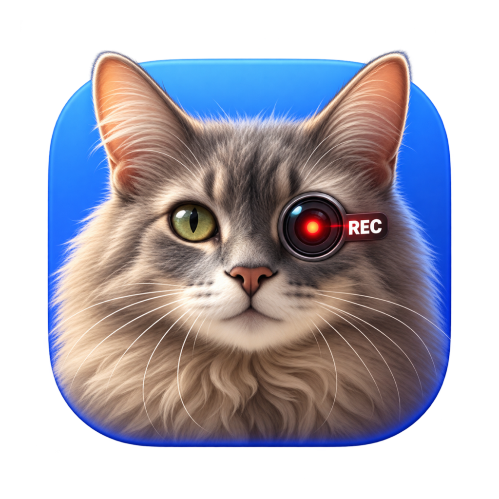

<p align="center">
  
</p>

<h1 align="center">TedCat</h1>

<p align="center">Hold to screenshot. Shift-hold to record. One menu item to record the computer's audio.</p>

[](https://github.com/irobson/tedcat/actions/workflows/ci.yml)


[](LICENSE)

A tiny macOS menu bar app that turns one mouse gesture into a region screenshot or a region screen recording, and records the computer's audio from its menu.

| How                                   | Result                                                    |
|---------------------------------------|-----------------------------------------------------------|
| **Hold**, drag, release               | Screenshot of the region, copied to the clipboard         |
| **⇧ Shift + Hold**, drag, release     | Video of the region with system audio, saved as an MP4    |
| Menu bar › **Record Audio Only**      | The computer's audio only, saved as an M4A                |

No hotkey to remember, no window to dismiss, no account, no network access.

Named after Ted, the cat with the recording eye on the icon.

## Features

- **Press-and-hold to capture.** Hold the mouse button still for a moment anywhere on screen, then drag out the area you want.
- **Screenshots straight to the clipboard.** PNG and TIFF at native Retina resolution. Nothing is written to disk.
- **Region screen recording.** Shift + hold records just the selected area, with system audio, and saves it automatically.
- **Audio-only recording.** One menu item records everything the computer plays, such as the other people in a video call. Handy for meeting notes and transcription.
- **Readable, light videos.** HEVC at native pixel density and 30 fps, with a bitrate that scales with the region size. Sharp enough to read code and slides, small enough to keep around, and ready for transcription tools.
- **Discreet controls.** A dashed outline marks the recorded area. A small timer pill sits in the screen corner farthest from it. One click stops and saves.
- **Clean output.** TedCat's own overlay, outline and pill never appear in screenshots or videos.
- **Ordinary clicks are untouched.** Quick clicks, double-clicks, drags and Shift-clicks reach your apps exactly as before.
- **Light.** One small native binary, no dependencies, no Dock icon, no background daemons.

## Installation

TedCat is not notarized yet, so you build it yourself or download a CI build.

### Build from source

Requirements: macOS 14 Sonoma or later, and a Swift 6 toolchain: Xcode 16 or later, or the Command Line Tools 16 or later (`xcode-select --install`).

```bash
git clone https://github.com/irobson/tedcat.git
```

```bash
cd tedcat
```

```bash
make bundle
```

```bash
make install
```

`make install` copies the app to `/Applications` and leaves it **closed**. Grant the permissions below first, then open TedCat from Spotlight. Ted's cat icon appears in the menu bar; its camera-lens eye turns red while recording.

### Download a CI build

Every push to `main` produces a universal app that runs on Apple silicon and Intel.

1. Open the latest successful [CI run](https://github.com/irobson/tedcat/actions/workflows/ci.yml) and download the `TedCat-<commit>` artifact. Downloading artifacts requires a GitHub login.
2. GitHub wraps the artifact in its own zip. Unzip it, then unzip the `TedCat.zip` inside.
3. Move `TedCat.app` to `/Applications`.

The build is ad-hoc signed and not notarized, so macOS blocks the first launch.

- **macOS 15 and later:** open the app once and dismiss the warning. Then go to **System Settings › Privacy & Security**, scroll down and click **Open Anyway**.
- **macOS 14:** right-click the app, choose **Open**, then confirm.

If you prefer the terminal, removing the quarantine flag has the same effect:

```bash
xattr -dr com.apple.quarantine /Applications/TedCat.app
```

### Grant permissions

On first launch macOS asks for two permissions. TedCat cannot work without them.

| Permission                           | Why                                                        | Where                                                       |
|--------------------------------------|------------------------------------------------------------|-------------------------------------------------------------|
| **Accessibility**                    | To notice the press-and-hold and replay normal clicks      | System Settings › Privacy & Security › Accessibility        |
| **Screen & System Audio Recording**  | To read the pixels and the audio of the selected region    | System Settings › Privacy & Security › Screen & System Audio Recording. On macOS 14 the pane is called **Screen Recording** |

Turn **TedCat** on in both lists. If it is missing, click **+** and pick `/Applications/TedCat.app`.
macOS restarts the app after you grant screen recording. The menu bar menu also has shortcuts to both settings panes.

## Usage

### Take a screenshot

1. Press the mouse button and keep it **still** for about a third of a second.
2. The screen dims.
3. Drag to size the area. A white frame follows the pointer. A label shows its size in points. Press **Esc** to cancel.
4. Release. The area flashes and the image is on your clipboard.
5. Paste it anywhere with **⌘V**.

### Record the screen

1. Hold **⇧ Shift**, press the mouse button and keep it still for the same moment.
2. The screen dims and a **● REC · drag to select an area** label appears where you pressed. You can let go of Shift now; the mode is fixed at the press.
3. Drag to size the area. The frame is **red** and the label shows its size. Release, and recording starts immediately. Releasing without dragging, or on an area too small to film, does nothing.
4. A dashed red outline marks what is being recorded. A small pill with a timer appears in a screen corner.
5. Click the pill to stop, or choose **Stop Recording** in the menu bar menu.
6. The pill shows **Saving…**, then a card takes its place in the same corner. It shows the file name, the folder, the size and the length, with a thumbnail of the video.
7. Click the card to play the file in QuickTime Player, drag the thumbnail into another app to use the file there, or click **Show in Finder**. The card hides after a few seconds; resting the pointer on it keeps it open.

### Record audio only, for example a meeting

1. Click the menu bar icon and choose **Record Audio Only**. Recording starts immediately.
2. The pill appears in the bottom-right corner with a red waveform and a timer. There is no outline, because no area is filmed.
3. Click the pill, or choose **Stop Recording** in the menu, to stop. The same saved card appears, with a waveform instead of a thumbnail.

TedCat records what the computer plays: the voices of the other people in a Zoom, Meet or Teams call, a video, a podcast. It works with headphones and AirPods too, because the audio is taken before it reaches the output device. **Your own microphone is not recorded.**

### Where recordings go

Recordings are saved to `~/Movies/TedCat/` with names like `TedCat 2026-10-04 at 14.03.22.mp4`, or `.m4a` for audio only.
Only one recording runs at a time. Screenshots keep working while you record.
Quitting TedCat during a recording saves the file before the app exits.

### Recording formats

| Recording   | Format                                                                                   |
|-------------|------------------------------------------------------------------------------------------|
| Video       | HEVC (H.265) in MP4, native pixel density, 30 fps, 1.5 to 6 Mbps by area size            |
| Video audio | AAC, 48 kHz stereo, 128 kbps                                                             |
| Audio only  | AAC in M4A, 48 kHz stereo, 128 kbps, about 1 MB per minute                               |

A full Retina screen comes to roughly 45 MB per minute of video. Window-sized areas are much smaller.

Both formats work directly with most transcription tools. To convert to the 16 kHz mono WAV that Whisper prefers:

```bash
ffmpeg -i "TedCat 2026-10-04 at 14.03.22.m4a" -ac 1 -ar 16000 audio.wav
```

### Things that keep working normally

TedCat briefly holds back each mouse press while it waits to see whether you are holding still. If you release or move before the hold time, it replays the original press, so:

- Clicks, double-clicks and drags behave as usual. A click registers on release instead of on press.
- Shift-click and Shift-drag, for example to extend a text selection or select several files, are unaffected.
- Moving the pointer slightly while pressing (up to 4 points) still counts as holding still.

## Settings

Everything is in the menu bar menu.

| Setting                    | Default                | Options                                                       |
|----------------------------|------------------------|---------------------------------------------------------------|
| Enabled                    | On                     | When off, TedCat does not touch any mouse event           |
| Trigger                    | Hold only              | ⌃ Control, ⌥ Option or ⌘ Command + Hold                       |
| Hold Duration              | 350 ms                 | 200, 350, 500 or 750 ms                                       |
| Play Sounds                | Off                    | Sounds on screenshot and on recording start and stop          |
| Launch at Login            | Off                    | Requires the app in a bundle, for example in `/Applications`  |
| Include System Audio in Videos | On                 | Add what you hear to video recordings. Audio-only recordings always capture it |
| Recordings Folder          | `~/Movies/TedCat`  | Any folder, via **Change Recordings Folder…**                 |

If holding anywhere feels too eager, pick a trigger modifier. With **⌃ Control + Hold**, screenshots need ⌃ held and recordings need ⌃⇧. Shift is reserved for recording and cannot be the trigger.

The same settings live in `UserDefaults` and can be scripted:

```bash
defaults write dev.tedcat.TedCat holdDuration -float 0.5
```

```bash
defaults write dev.tedcat.TedCat moveTolerance -float 6
```

```bash
defaults write dev.tedcat.TedCat recordingsFolder ~/Desktop
```

For a trigger modifier, pass an integer with `-int`: Control `262144`, Option `524288`, Command `1048576`. Add the values together to require more than one.

```bash
defaults write dev.tedcat.TedCat requiredModifiers -int 262144
```

Gesture settings apply from the next press. The recordings folder applies from the next recording.

## Troubleshooting

**Nothing happens when I hold the mouse button.**
Accessibility is missing. The menu bar icon looks dimmed and the menu says *Waiting for Accessibility permission…*. Turn TedCat on under Accessibility; the app picks it up within two seconds.

**The pill says Failed, or the screenshot never reaches the clipboard.**
Screen recording permission is missing. Turn TedCat on under Screen & System Audio Recording, called Screen Recording on macOS 14, and let macOS restart it.

**The permission toggles are on, but it still fails.**
macOS ties permissions to the app's signature, and every rebuild of an ad-hoc signed app changes it. Quit TedCat first (menu bar › **Quit TedCat**). Then reset both permissions, grant them again and open the app:

```bash
tccutil reset Accessibility dev.tedcat.TedCat
```

```bash
tccutil reset ScreenCapture dev.tedcat.TedCat
```

To avoid this when building often, sign with a stable identity from your keychain:

```bash
SIGN_IDENTITY="Apple Development: Your Name (TEAMID)" make bundle
```

**I want to see what TedCat is doing.**

```bash
log stream --predicate 'subsystem == "dev.tedcat.TedCat"' --level debug
```

## Known limitations

- A selection stays on the display where it started.
- Recordings capture the computer's audio only, not the microphone. In a call, your own voice is missing.
- The pointer does not turn into a crosshair during selection. The dimmed overlay is the cue.
- Controls that react to press-and-hold at the exact spot you press, such as Dock icons, feel the hold delay. A trigger modifier avoids that.
- Esc cannot cancel a selection while a secure text field, such as a password field, has focus.

## Privacy

TedCat has no network code. Screenshots go only to your clipboard and recordings only to the folder you choose. Nothing is collected or sent anywhere.

## Development

```bash
make run
```

```bash
make test
```

| Command        | What it does                                                         |
|----------------|----------------------------------------------------------------------|
| `make build`   | Debug build                                                          |
| `make run`     | Run straight from the package, without an app bundle                 |
| `make test`    | Unit tests for the gesture state machine, the recording target and the video encoding plan. Uses Swift Testing, which ships with Swift 6 |
| `make bundle`  | Release build wrapped in `build/TedCat.app`. Add `UNIVERSAL=1` for arm64 + x86_64 (needs Xcode) |
| `make install` | Copy the last bundle to `/Applications` without rebuilding, and leave it closed so permissions can be granted safely |
| `make open`    | Bundle and launch from `build/`                                      |
| `make clean`   | Remove build products                                                |

`make install` deliberately never rebuilds, so the signature your permissions are tied to stays the same.

> **Important:** never turn off TedCat's Accessibility switch, or run `tccutil reset`, while TedCat is running and active. Turning it on while the menu says *Waiting for Accessibility permission…* is safe, because nothing is intercepted yet. When in doubt, quit TedCat before touching its permissions. Its event tap holds each click until it knows whether you are holding still. If macOS withdraws the permission mid-session, the tap stays installed but can no longer hand clicks back, so every left click is lost until the app quits. If that happens, use the keyboard: **⌘ Space**, type **Terminal**, Return, then run `pkill -x TedCat`.

How the gesture detection, recording pipeline and coordinate handling work is described in [docs/ARCHITECTURE.md](docs/ARCHITECTURE.md).

```
TedCat/
├── Package.swift
├── Makefile
├── Resources/
│   ├── Info.plist                # bundle metadata (menu bar only, bundle id, icon)
│   └── Icons/                    # app icon and menu bar glyph masters; sizes are generated by bundle.sh
├── scripts/
│   ├── bundle.sh                 # SwiftPM build into a signed .app
│   └── test.sh                   # swift test, with a Command Line Tools workaround
├── Sources/
│   ├── TedCatCore/           # pure logic: gesture state machine, geometry, recording target, encoding plan
│   └── TedCat/
│       ├── App/                  # entry point, app delegate, menu bar
│       ├── Capture/              # event tap, controller, screenshot capture, clipboard
│       ├── Recording/            # recorder, recording controller, outline, stop pill
│       ├── Overlay/              # selection window and layer-based view
│       └── Support/              # preferences, permissions, coordinates, logging
├── Tests/TedCatCoreTests/
├── docs/ARCHITECTURE.md
└── .github/workflows/ci.yml      # test and build a universal app on every push
```

## Roadmap

- Signed and notarized releases.
- Fail-safe click handling: release intercepted clicks automatically if macOS stops accepting them, plus an emergency keyboard switch.
- Optional save-to-file for screenshots.
- Microphone track for recordings.
- Selections across multiple displays.

See the [issues](https://github.com/irobson/tedcat/issues) for what is planned.

## License

MIT. See [LICENSE](LICENSE).
